# Wet tot instelling van Eervolle Onderscheidingen

_Aan alle idioten, die zijn of nog zullen komen, TABÉ._

_De Volkvergadering heeft beslist:_

--------------------------
import {ArticleProvider, Article, ArticleBis, ArticleTer, ArticleQuater} from "@site/src/components/Article"

<ArticleProvider>
<Article/>
De Volksvergadering heeft het exclusieve recht om Eervolle Onderscheidingen in te stellen en toe te kennen.

<Article/>
Voor uitzonderlijke diensten aan de Vrijstaat wordt de Orde van de Verwarde Opossum ingesteld met volgende graden:

* Ridder van de Verwarde Opossum
* Officier van de Verwarde Opossum
* Opossum
* Grootopossum
* Verwarde Opossum

<Article/>
Voor uitzonderlijke diensten op het gebied van de kunsten, wetenschap of industrie wordt de Orde van de Natte Prei ingesteld met volgende graden:

* Ridder van de Natte Prei
* Officier van de Natte Prei
* Natte Prei
* Zeer Natte Prei
* Preisoep

<Article/>
Volgende militaire eretekens worden ingesteld:

* Oorlogskruis, voor daden van moed tegenover de vijand in oorlogstijd.
* Ijzeren Kruis, voor daden van moed, buitengewone toewijding of dienstanciënniteit.

<Article/>
Volgende burgelijke eretekens worden ingesteld:

* Rode Kruis, voor daden van moed en zelfopoffering.
* Bronzen Kruis, voor diensten aan de Vrijstaat of dienstanciënniteit.

<Article/>
Enkel de hoogste graad van iedere orde of hoogste klasse van ieder ereteken wordt gedragen.

<Article/>
De decoraties van de Eervolle Onderscheidingen worden in volgende volgorde op de linkerborst gedragen:

| Onderscheiding                    | Decoratie |
|---                                |---|
| Oorlogskruis                      | 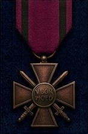 |
| Rode Kruis                        | 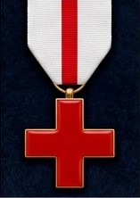 |
| Verwarde Opossum                  | 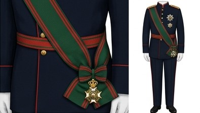 |
| Preisoep                          | 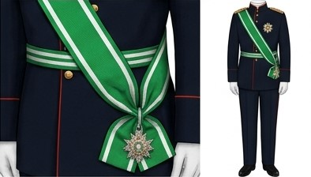 |
| Grootopossum                      | 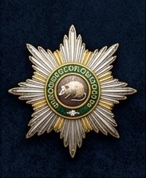 |
| Zeer Natte Prei                   | 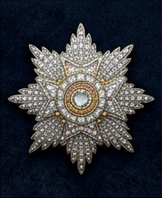 |
| Opossum                           | 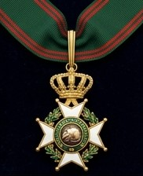 |
| Natte Prei                        | 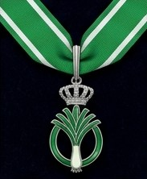 |
| Officier van de Verwarde Opossum  | 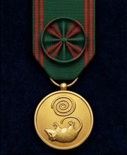 |
| Officier van de Natte Prei        | 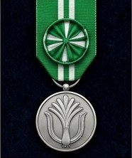 |
| Ridder van de Verwarde Opossum    | 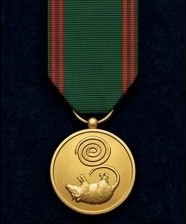 |
| Ridder van de Natte Prei          | 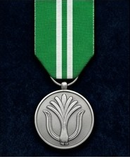 |
| Ijzeren Kruis, Eerste Klasse      | 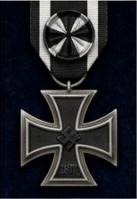 |
| Ijzeren Kruis, Tweede Klasse      | 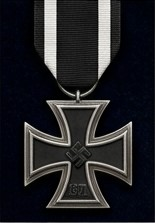 |
| Bronzen Kruis, Eerste Klasse      | 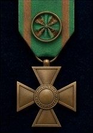 |
| Bronzen Kruis, Tweede Klasse      | 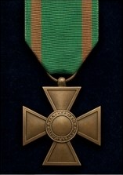 |

</ArticleProvider>
--------------------------

_Buriku de Linkerbil Beloved Oppressor Aladeen & Buriku de Rechterbil Nuclear Nadal, Procurer of Women_

_Op den `<Datum>`_
